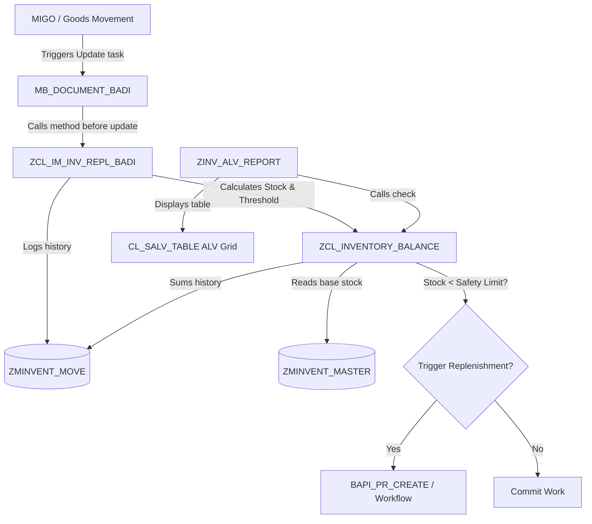

# SAP Custom Inventory Management & Automated Replenishment

This project is a high-fidelity representation of an end-to-end custom warehouse tracking and stock replenishment system built on **SAP NetWeaver Application Server ABAP**. It combines modern database layout, Object-Oriented ABAP design principles, BAdI enhancements, and ALV Grid reporting, fully managed using standard `abapGit` version control practices.

To showcase this architecture interactively, the project includes both:
1. **Production-Ready abapGit Files**: Serialized source code and XML metadata structure ready to be imported into any SAP system via `abapGit`.
2. **Interactive Web-Based Simulator**: A premium web dashboard (HTML5/CSS3/JavaScript) that simulates the full SAP process lifecycle (Goods Movements -> BAdI triggers -> OO Calculations -> Workflow Replenishment -> ALV Grid alerts -> abapGit synchronization).

---

## 🛠️ System Architecture

The project represents a standard decoupled SAP custom application design:

### 1. Data Dictionary (DDIC) Tables
- **`ZMINVENT_MASTER`** (Material Master Custom Ext): Holds client-plant-storage-location specific records, baseline valuated stock, unit of measure, safety stock threshold, reorder quantities, and active purchase requisition mappings.
- **`ZMINVENT_MOVE`** (Movement Log): Tracks goods issues and receipts, acting as the custom delta table for real-time adjustments.

### 2. Object-Oriented Balance Engine (`ZCL_INVENTORY_BALANCE`)
- Encapsulates inventory arithmetic.
- Method `calculate_realtime_balance` reads the master baseline and applies all posted document movements (adding receipts, subtracting issues) to determine the exact current stock.
- Method `check_safety_threshold` returns whether the material has breached its minimum safety margin.
- Method `trigger_replenishment` generates automated purchase requisition numbers (simulating SAP workflow triggers).

### 3. Business Add-In (BAdI) Enhancement (`ZCL_IM_INV_REPL_BADI`)
- Implements standard SAP `MB_DOCUMENT_BADI` (specifically method `MB_DOCUMENT_BEFORE_UPDATE`).
- Automatically intercepts all standard material document update steps.
- Evaluates stock limits in the background, logging custom movements and dynamically triggering replenishment workflows immediately when safety stocks are breached.

### 4. Interactive ALV Grid Report (`ZINV_ALV_REPORT`)
- An ABAP reporting program using `CL_SALV_TABLE` to render a user-friendly table for warehouse managers.
- Color codes rows matching critical alerts in red.
- Includes a secondary drill-down ALV Grid displaying the movements log for any selected material when double-clicked.

### 5. Git Lifecycle Management (`abapGit`)
- All components are serialized according to `abapGit` standards, maintaining modern version control structures.

---

## 🚀 Running the Web Simulator

You can run the interactive simulation dashboard locally to see the system flow in action.

### Option A: Direct Launch (No installation)
1. Open the project folder.
2. Double-click the [index.html](file:///Users/aaryankarthik/.gemini/antigravity/scratch/sap-inventory-management/index.html) file to launch it directly in your web browser.

### Option B: Local Node Server
1. Navigate to the project root directory in your terminal.
2. Run `npm install` to install local development dependencies.
3. Run `npm start` to fire up the local development server (uses `lite-server`).
4. The dashboard will launch at `http://localhost:3000`.

---

## 🕹️ Interactive Simulation Walkthrough

1. **Dashboard Overview**: Check the dashboard tiles to see summary metrics (Tracked SKUs, active alerts, etc.).
2. **Review Initial Grid**: Go to the **ALV Grid Report** tab. You will see five materials with green status checkmarks.
3. **Trigger BAdI Replenishment**:
   - Go to **MIGO Movement**.
   - Select material `Z-200` (Pneumatic Actuator, current stock 45, safety limit 30).
   - Post a **201 Goods Issue** of **20 PCS** (which drops the stock level to 25, breaching the threshold).
   - Press **Post Goods Movement**.
4. **Inspect Console Logs**:
   - Watch the **BAdI Interception Logs** output in real-time.
   - Observe standard SAP hooks executing, Z-class threshold checking, and the replenishment workflow creating a simulated Purchase Requisition (e.g. `900xxxxxxx`).
5. **Observe Updated ALV**:
   - Return to the **ALV Grid Report**.
   - Notice that `Z-200` is now colored **red**, showing the active alert status, the live stock of 25, and the generated Purchase Requisition document number.
6. **Code & Version Control**:
   - Browse the **ABAP Source Code** tab to view the actual class code.
   - Toggle **Edit Mock Code** and save a small text tweak.
   - Go to the **abapGit Control** tab. You will see that the system detected "local database drift". Stage and commit the change to see the Git log update!
7. **Reset Database**: Use the **Reset Stock Baseline** button on the ALV report toolbar to revert inventory back to start levels at any time.
